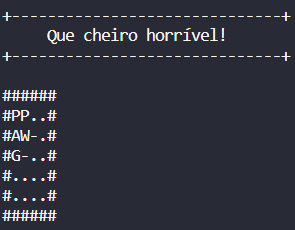

# Mundo Wumpus

> O Mundo de Wumpus é um  jogo antigo de computador considerado um domínio (ambiente) artificial que fornece grande motivação para o raciocínio lógico. Apesar de parecer um jogo muito simples quando comparado aos jogos modernos de computador, o Mundo de Wumpus é um excelente ambiente de teste para agentes inteligentes.
> Baseado em um agente que explora uma caverna, o ambiente consiste de compartimentos conectados por passagens sendo que em um desses compartimentos está o Wumpus: um monstro que devora qualquer um que entrar em seu compartimento. Para piorar a situação, alguns dos compartimentos possuem abismos que engolem qualquer um que entrar neles, menos o Wumpus que é muito grande para cair. A única motivação para o agente permanecer nesse ambiente é a caçada pelo ouro.

---
# Possibilidades desenvolvidas

> O labirinto é gerado aleatoriamente tendo de 6 a 10 linhas e de 6 a 10 colunas, com as posições de Abismo, Wumpus e Ouro também sendo aleatórias.

### Iniciamos na casa 1,1 e pegamos a flecha!

> Após isso o movimento no array bidimensional é feito através de pilha

### Andando pelo labirinto você pode sentir uma brisa que vem do abismo ou um cheiro horrível do wumpus

### Ao encontrar o Wumpus, você pode ter a sorte de mata-lo, fugir, ou infelizmente ter um destino mais trágico.

### Se tudo der certo e seu dia for incrível, pode ser presenteado com o ouro.

